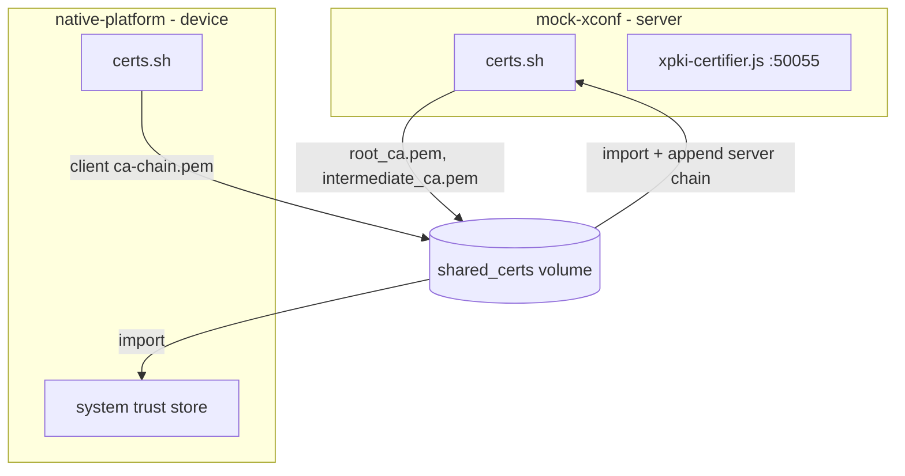
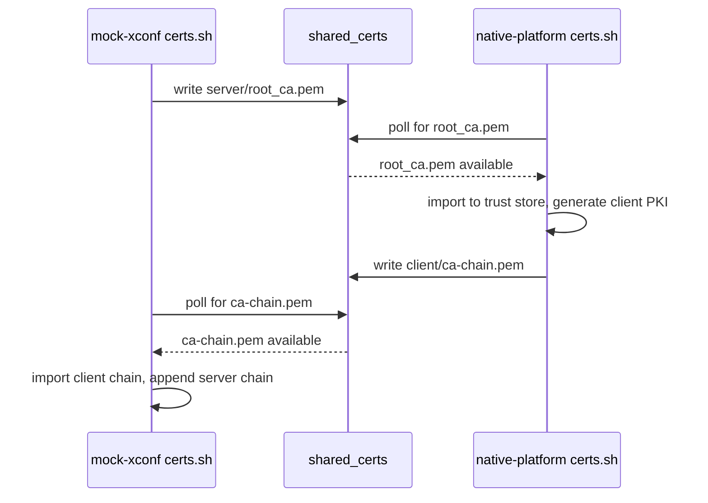
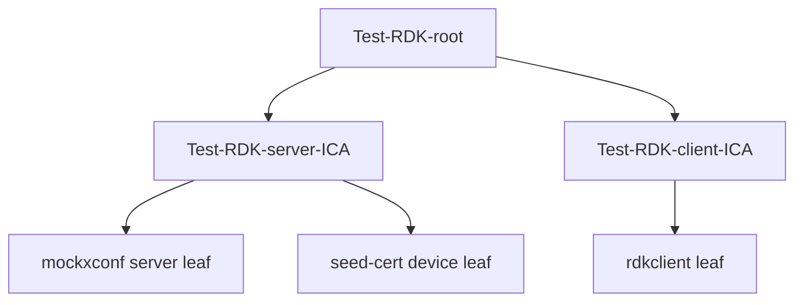

# Technical Documentation Writer for Docker Certificate Test Harness

## Purpose

Create clear, comprehensive, and maintainable technical documentation for this
Docker-based device-management test harness, with focus on the **certificate /
mTLS / PKI subsystem**: cross-container certificate generation, the shared-volume
handshake contract, trust-store operations, PKCS#11 (SoftHSM) integration, and
the xPKI certificate-procurement flow.

This is a **brownfield** documentation skill: the primary job is to describe
existing, already-merged behaviour accurately — not to design new features. When
documenting, read the actual shell scripts, Dockerfiles, `compose.yaml`, and
Node.js mock services and describe what they *do today*.

## Scope note (security team)

This repository is maintained partly by a **security team** whose remit is the
certificate/TLS/PKI surface. When breadth or diagram size becomes unwieldy,
**prioritise the certificate subsystem** (cert generation, mTLS handshake,
trust stores, PKCS#11, CRL/OCSP/cross-signing, xPKI) over unrelated platform
concerns (RFC providers, tr69hostif, log upload, DCM). Platform-owned areas can
be documented separately by the platform team.

## Usage

Invoke this skill when:

- Documenting the certificate / mTLS / PKI flow between containers
- Describing the shared-volume handshake contract and its ordering guarantees
- Writing a configuration reference for `ENABLE_MTLS`, `ENABLE_PKCS11`, ports,
  cert paths, and CertSelector `.cfg` files
- Documenting PKCS#11 / SoftHSM token setup and the OpenSSL PKCS#11 patch
- Documenting the xPKI certifier mock service and CSR-signing behaviour
- Creating onboarding/integration guides for building and running the harness
- Writing troubleshooting guides for cert generation or handshake failures

## How This Differs From the Embedded-C Original

This skill is adapted from the telemetry `technical-documentation-writer`. The
subject matter is Docker/shell/Node.js, not embedded C/C++, so the emphasis is
remapped:

| Embedded-C original            | This project (remapped)                                  |
| ------------------------------ | -------------------------------------------------------- |
| Threading model / mutexes      | Container startup ordering & cross-container sync (waits) |
| Memory ownership / lifecycle   | Certificate & key lifecycle, file ownership/permissions   |
| API reference (C functions)    | Script entry points, env-var contracts, on-disk paths     |
| Doxygen comments               | Inline shell/JS comments + generated reference tables     |
| Stack/heap budgets             | File-permission modes, trust-store footprint, port map    |
| Platform notes (ARM/RDKB)      | Container base image, OpenSSL/SoftHSM versions, volumes    |

Keep everything else (Mermaid diagrams, concise style, quality checklist,
cross-references) the same.

## Documentation Structure

### Directory Layout

```
docker-device-mgt-service-test/
├── README.md                          # Project overview, quick start
├── docs/
│   ├── README.md                      # Documentation index
│   └── certificates/                  # Certificate subsystem (security team)
│       ├── README.md                  # Cert subsystem overview + index
│       ├── architecture.md            # Two-container PKI architecture + diagrams
│       ├── certificate-lifecycle.md   # Generation → handshake → trust flow
│       ├── shared-volume-contract.md  # File contract & ordering guarantees
│       ├── configuration.md           # Env vars, ports, paths, CertSelector cfg
│       ├── pkcs11.md                  # SoftHSM / OpenSSL PKCS#11 patch flow
│       ├── xpki-certifier.md          # xPKI CSR-signing mock service
│       └── troubleshooting.md         # Common cert/handshake failures
```

Collapse files where a subsystem is small — do not create empty stubs. For a
focused brownfield pass, `README.md`, `architecture.md`, `configuration.md`, and
`troubleshooting.md` are usually the minimum viable set.

### Document Types

1. **Architecture** (`docs/certificates/architecture.md`) — container roles,
   PKI hierarchy, data flow across the shared volume, trust relationships.
2. **Lifecycle / process** (`certificate-lifecycle.md`) — ordered sequence of
   who generates what, when, and how the mTLS handshake is established.
3. **Contract references** (`shared-volume-contract.md`, `configuration.md`) —
   exact file paths, permissions, env-var semantics, defaults.
4. **Integration guides** — build & run instructions, image tags, compose usage.
5. **Troubleshooting** — symptom → cause → fix for cert/handshake failures.

## Documentation Process

### Step 1: Analyze the Code

Before writing:

1. **Read the shell scripts** — `*/certs.sh`, `*/entrypoint.sh`, `certs.sh`
   helpers, `*/Dockerfile`. These are the source of truth for cert behaviour.
2. **Read the orchestration** — `compose.yaml` (services, ports, volumes,
   `depends_on`, environment).
3. **Read the mock services** — Node.js files that consume certs
   (`xpki-certifier.js`, `server-utils.js`, endpoint servers).
4. **Map the cross-container contract** — what each side writes to / reads from
   `/mnt/L2_CONTAINER_SHARED_VOLUME/shared_certs` and the wait-loops that gate on it.
5. **Trace the certificate lifecycle** — generation (rdk-cert-config scripts),
   export, import into trust store, cleanup (`rm -f` after import).
6. **Note the security posture** — which services enforce mTLS, which
   intentionally do not (and why), file permission modes (`chmod 600` on keys).
7. **Distinguish committed vs local** — for a brownfield doc, describe only what
   is merged on the baseline branch, not uncommitted feature work.

### Step 2: Create Structure

Use this component template:

```markdown
# [Component / Subsystem Name]

## Overview
Brief 2-3 sentence description of purpose and role.

## Architecture
High-level design with a Mermaid diagram.

## Key Files
Scripts, services, and on-disk artifacts (path + role table).

## Startup & Ordering
Container startup order, wait-loops, and cross-container synchronization.

## Certificate & Key Lifecycle
What is generated, where it is written, permissions, export, import, cleanup.

## Configuration
Environment variables, ports, config files, defaults.

## Security Considerations
mTLS enforcement, key permissions, intentional exceptions, test-only caveats.

## Error Handling
Failure modes, exit codes, log markers (e.g. `[certs]`), recovery.

## Testing
How to exercise the flow, what "healthy" looks like, log signatures.

## See Also
Cross-references to related docs.
```

### Step 3: Add Diagrams

Use Mermaid for all diagrams (version-control friendly, renders in VS Code and
GitHub).

**Container / component diagram**



**Handshake sequence diagram**



**PKI hierarchy (state/tree)**



Keep diagrams to ~10-12 nodes. Split large flows into overview + detail diagrams.

### Step 4: Document Scripts & Entry Points

Instead of C function signatures, document **script entry points and their
env-var / file contracts**:

```markdown
### native-platform/certs.sh

Runs at container start (invoked by entrypoint.sh). Establishes the device-side
mTLS trust flow.

**Inputs (environment):**
- `ENABLE_MTLS` (default `false`) — when `true`, generate client PKI and export chain
- `ENABLE_PKCS11` (default `false`) — when `true`, set up SoftHSM + OpenSSL PKCS#11 patch
- `MOCKXCONF_HOST` (default `mockxconf`) — server hostname for the DNS gate

**Reads:**
- `/mnt/L2_CONTAINER_SHARED_VOLUME/shared_certs/server/root_ca.pem` (waits for it)

**Writes:**
- `/usr/share/ca-certificates/mock-xconf-root-ca.pem` (trust store)
- `/opt/certs/client.p12`, `/opt/certs/client.pem`
- `/etc/ssl/certsel/certsel.cfg`
- `/mnt/.../shared_certs/client/ca-chain.pem` (export to server)

**Exit codes:** `0` success; non-zero aborts container startup (entrypoint checks `$?`).

**Log markers:** `[certs] ...`
```

### Step 5: Document the Shared-Volume Contract

Because synchronization here is **file-based across containers**, treat the
shared volume like an API surface. Document every path, its producer, consumer,
permissions, and whether it is cleaned up:

```markdown
| Path (under shared_certs/) | Producer      | Consumer        | Perms | Cleaned up? |
| -------------------------- | ------------- | --------------- | ----- | ----------- |
| server/root_ca.pem         | mock-xconf    | native-platform | 644   | yes (native rm) |
| server/intermediate_ca.pem | mock-xconf    | native-platform | 644   | yes (native rm) |
| client/ca-chain.pem        | native-platform | mock-xconf    | -     | yes (server rm) |
| client/seed-cert.{pem,key,p12} | mock-xconf | native-platform | 644/600 | no |
```

### Step 6: Document Security Posture

Always call out mTLS enforcement decisions and key handling explicitly:

```markdown
## Security Considerations

- Private keys are written with `chmod 600` (e.g. server key, seed key).
- Public certs/chains use `chmod 644`.
- The xPKI certifier (`:50055`) **intentionally does not enforce mTLS**: clients
  must obtain a certificate before they can present one, so requiring client
  auth would deadlock procurement. This is a deliberate, documented exception.
- All CAs and certs here are **test-only** (`Test-RDK-*`). Never reuse in production.
- Admin/test-control endpoints are unauthenticated — test harness only.
```

### Step 7: Document Configuration

```markdown
## Configuration

### Environment Variables

| Variable        | Default    | Applies to        | Effect |
| --------------- | ---------- | ----------------- | ------ |
| ENABLE_MTLS     | false      | both containers   | Enable client-cert generation & handshake |
| ENABLE_PKCS11   | false      | native-platform   | Route client key through SoftHSM / PKCS#11 |
| MOCKXCONF_HOST  | mockxconf  | native-platform   | Server hostname for DNS gate before import |

### Ports (compose.yaml)

| Port  | Service                 | Notes |
| ----- | ----------------------- | ----- |
| 50055 | xPKI certifier          | CSR signing, no mTLS |
| ...   | ...                     | ...   |
```

## Best Practices

### Writing Style

1. **Be Concise** — get to the point quickly.
2. **Be Specific** — use exact paths, exact env-var names, exact log markers.
3. **Be Accurate** — verify every path and permission against the actual script.
4. **Be Complete** — don't leave the ordering/handshake half-described.
5. **Be Consistent** — follow the templates and existing repo style.

### Shell / Compose Examples

- Prefer **copy-pasteable** commands (`docker compose up -d`, `docker exec ...`).
- Show the **healthy log signature** so readers can confirm success.
- Show **cleanup** steps (down, removing lingering containers/ports).
- Keep one example per concept.

### Diagrams

- Use Mermaid for all diagrams.
- Max ~10-12 nodes; split when larger.
- Label every edge (what file/data flows).
- Show direction of the cross-container handshake clearly.

### Cross-References

```markdown
## See Also

- [Certificate Architecture](architecture.md) — container roles & PKI hierarchy
- [Shared-Volume Contract](shared-volume-contract.md) — file-level sync contract
- [Configuration Reference](configuration.md) — env vars, ports, paths
- [Troubleshooting](troubleshooting.md) — handshake & generation failures
```

### Platform / Environment Notes

Always document environment specifics:

```markdown
## Platform Notes

### Container base
- Ubuntu-based images; certs via rdk-cert-config (pinned tag, e.g. 1.0.6).
- OpenSSL with optional PKCS#11 patch; SoftHSM for the token.

### Shared volume
- Host `../` is mounted at `/mnt/L2_CONTAINER_SHARED_VOLUME` in every container.
- The PKI exchange dir is `.../shared_certs/{server,client}`.

### Windows host caveats
- Port 50060 may linger after `down`; `docker rm -f mockxconf` before re-`up`.
```

## Quality Checklist

Before considering documentation complete:

- [ ] Every documented path/permission verified against the actual script
- [ ] Environment variables listed with defaults and effects
- [ ] The cross-container handshake ordering is explicit (who waits on what)
- [ ] Shared-volume producer/consumer/cleanup table present
- [ ] Security posture (mTLS enforcement, key perms, exceptions) stated
- [ ] At least one Mermaid diagram for the overall flow
- [ ] A "healthy log signature" example included
- [ ] Cross-references to related docs
- [ ] Only committed/baseline behaviour documented (for brownfield passes)
- [ ] Grammar and spelling checked

## Maintenance

Documentation is code:

1. **Update with code changes** — when a `certs.sh` path or env var changes,
   update the corresponding table in the same PR.
2. **Version references** — note the pinned rdk-cert-config tag the docs assume.
3. **Review periodically** — re-verify paths/permissions after cert refactors.
4. **Fix broken links** — validate cross-references.
5. **Mark test-only clearly** — never let a reader mistake a `Test-RDK-*` CA for
   something production-safe.

## Examples From This Project

Reference material grounded in the actual repo:

- `native-platform/certs.sh` — device-side trust flow, client PKI, PKCS#11, CertSelector cfg
- `mock-xconf/certs.sh` — server PKI, seed cert (RDK-61060), mTLS wait for client chain
- `mock-xconf/xpki-certifier.js` — CSR signing service on :50055 (no mTLS, by design)
- `compose.yaml` — service/port/volume wiring
- `README.md` — existing high-level HTTPS/self-signed cert notes
