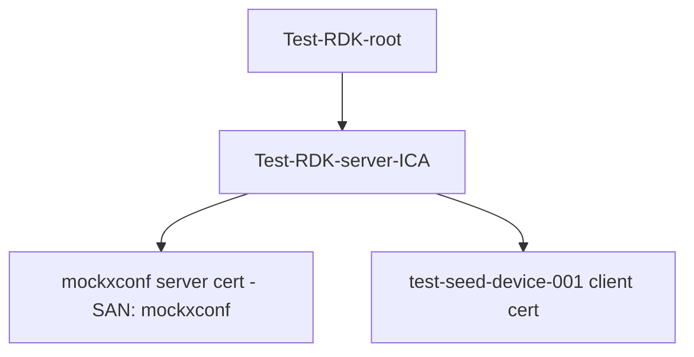
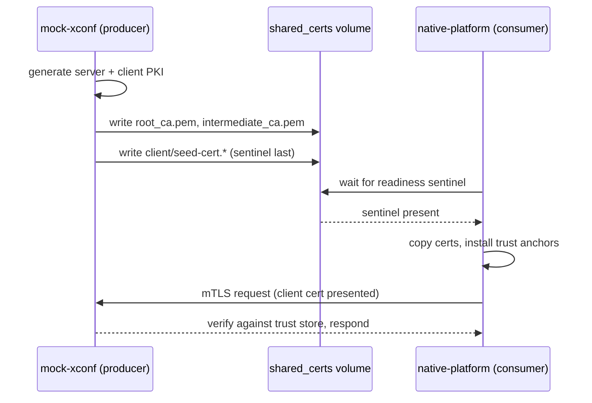
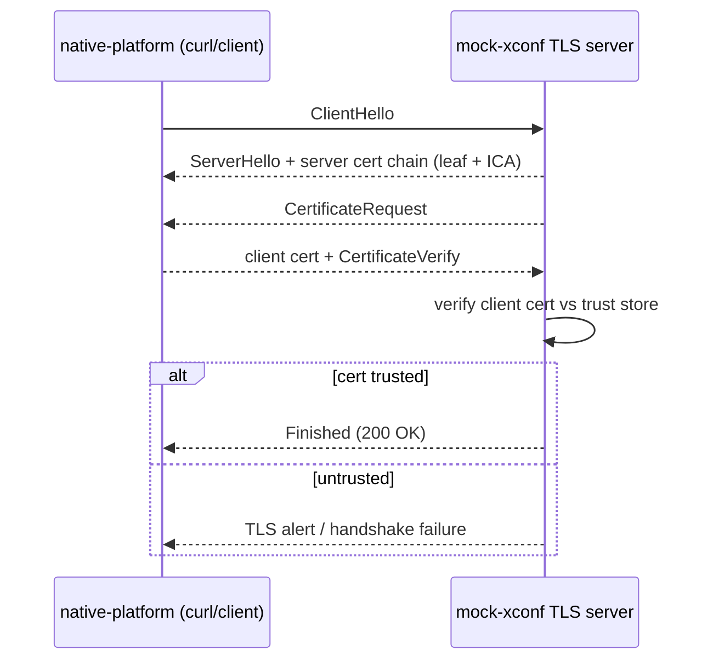

# Technical Documentation Writer for the Docker Device-Mgmt Test Infrastructure

## Purpose

Create clear, comprehensive, and maintainable technical documentation for the
`docker-device-mgt-service-test` repository, with focus on the **certificate /
TLS test infrastructure**: PKI hierarchies, trust-store construction, mutual TLS
(mTLS), and how the `mock-xconf` and `native-platform` containers exchange this
material over the shared volume.

This project is **not** an embedded C/C++ codebase. It is a Docker-based test
harness composed of:
- **Shell scripts** (`certs.sh`, `entrypoint.sh`) that drive OpenSSL-based PKI
  generation via the `rdk-cert-config` helper scripts.
- **Node.js mock servers** (`xpki-certifier.js` and the other `*.js` xconf
  mocks) that serve the mocked endpoints over TLS.
- **Docker Compose orchestration** (`compose.yaml`) with a two-container flow:
  `mock-xconf` produces certs, `native-platform` consumes them.

Tailor all examples, terminology, and diagrams to this stack (Docker, Bash,
OpenSSL, Node.js/TLS) — never to embedded C, threads, or malloc/free ownership.

## Usage

Invoke this skill when:
- Documenting the certificate generation flow (`certs.sh` and the
  `rdk-cert-config` generator scripts it calls).
- Describing a PKI hierarchy (root CA → intermediate CA → leaf/server/client).
- Documenting trust-store construction and how a container decides what to trust.
- Explaining an mTLS handshake and the client-cert selection flow.
- Writing an onboarding guide for how the two containers hand off PKI over the
  shared volume.
- Documenting the endpoints and ports exposed by the mock servers.
- Producing brownfield documentation of the pre-existing cert infrastructure
  before layering new-feature docs on top.

## Documentation Structure

### Directory Layout

Place documentation under a top-level `docs/` tree in the repo, mirroring the
runtime split between the two containers and the shared PKI they exchange.

```
docker-device-mgt-service-test/
├── README.md                          # Repo overview, quick start
├── docs/
│   ├── README.md                      # Documentation index
│   ├── architecture/
│   │   ├── overview.md                # Two-container test harness overview
│   │   ├── pki-hierarchy.md           # CA hierarchies (server ICA, client ICA)
│   │   ├── trust-model.md             # Trust-store construction & handoff
│   │   └── cert-exchange.md           # Shared-volume PKI handoff sequence
│   ├── certs/
│   │   ├── mock-xconf-certs.md        # mock-xconf/certs.sh walkthrough
│   │   ├── native-platform-certs.md   # native-platform/certs.sh walkthrough
│   │   └── mtls.md                    # Mutual-TLS setup and handshake
│   └── integration/
│       ├── compose-and-ports.md       # compose.yaml, published ports, env vars
│       ├── running-locally.md         # How to run the suite locally
│       └── troubleshooting.md         # Common cert/TLS failures
```

Keep the doc tree shallow. Not every file above is mandatory — create only the
pages the current change actually needs.

### Document Types

#### 1. Architecture Documentation (`docs/architecture/`)
- The two-container model (`mock-xconf` = CA/producer, `native-platform` = client/consumer).
- PKI hierarchies: which root signs which intermediate, which intermediate signs
  which leaf, and the Subject/CN/SAN of each.
- Trust model: what each side installs into its trust store and why.
- Cert-exchange sequence over the shared volume, including readiness sentinels.

#### 2. Certificate Flow Documentation (`docs/certs/`)
- Step-by-step walkthrough of each `certs.sh` (what it generates, copies, and waits for).
- mTLS: server cert, client cert, chains presented, verification direction.

#### 3. Mock-Server Documentation (`docs/servers/`)
- Per-server purpose, listening port, TLS mode, and endpoints.
- What certs/keys each server reads.
- Security posture (which ports are host-published vs internal-only).

#### 4. Integration Guides (`docs/integration/`)
- `compose.yaml` services, published ports, and environment toggles
  (`ENABLE_MTLS`, `ENABLE_PKCS11`).
- How to run the suite locally and how CI runs it.
- Troubleshooting common TLS/PKI failures.

## Documentation Process

### Step 1: Analyze the Code

Before writing documentation:

1. **Read the shell scripts** — `certs.sh` and `entrypoint.sh` in both
   `mock-xconf/` and `native-platform/`. Trace every `openssl`, `cp`, `cat >>`,
   and `while [ ! -f ... ]` wait loop.
2. **Read the generator scripts** — the `rdk-cert-config` scripts invoked via
   `/etc/pki/scripts/*.sh` (e.g. `generate_test_rdk_certs.sh`,
   `create_leaf_cert.sh`).
3. **Read the Node.js servers** — note the `tls`/`https` options object
   (`key`, `cert`, `ca`, `requestCert`, `rejectUnauthorized`).
4. **Map the PKI** — build the exact CA → ICA → leaf tree with real
   Subject/CN/SAN names as they appear on disk.
5. **Trace the handoff** — which file is written by the producer, which file the
   consumer waits on (the readiness sentinel), and where each lands in the
   trust store.
6. **Review existing docs** — match README tone and existing terminology.

Verify claims against the code. If a comment and the implementation disagree,
document the implementation and flag the mismatch.

### Step 2: Create Structure

For each certificate component or flow:

```markdown
# [Component / Flow Name]

## Overview
2–3 sentences: what this cert/flow is for and which container owns it.

## PKI Hierarchy
The CA chain involved (root → intermediate → leaf) with CN/SAN.

## Files & Locations
Table of every key/cert: on-disk path, shared-volume path, permissions.

## Flow
Step-by-step generation/exchange/verification, with a sequence diagram.

## Ports & Endpoints
Any listening ports and control endpoints (for server components).

## Configuration
Environment variables and toggles that affect this flow.

## Verification
Exact commands to confirm it works (openssl / curl).

## Failure Modes
What breaks it and the symptom in logs.

## See Also
Cross-references to related pages.
```

### Step 3: Add Diagrams

Use Mermaid for all diagrams (version-control friendly). Prefer these types for
this project:

#### PKI Hierarchy (tree)


#### Cert-Exchange Sequence (two containers + shared volume)


#### mTLS Handshake


Keep diagrams to ~10–12 nodes. Split large flows into an overview plus focused
detail diagrams.

### Step 4: Add Verification Commands

Instead of C code examples, document **exact, runnable shell commands** that
prove the flow. Always show the command, the relevant flags, and the expected
observable result.

#### Good Example Structure

````markdown
### Example: Verify the server accepts a valid client cert (mTLS)

**Prerequisites:**
- Both containers started with `ENABLE_MTLS=true`
- Client bundle present under `/opt/certs/` on native-platform

**Command:**
```sh
curl -sf \
  --cert /opt/certs/client.pem \
  https://mockxconf:<mtls-port>/ >/dev/null && echo "mTLS ok"
```

**Expected result:**
```
mTLS ok
```

**Notes:**
- Omitting `--cert` (no client cert) must fail the handshake — that is the
  mTLS enforcement being tested.
````

Always include a **negative** command where the point of the test is a rejection
(missing or untrusted client cert).

### Step 5: Document Certificates & Files

For each cert/key, document it as a table row rather than an API signature:

```markdown
## Files & Locations

| Artifact | Producer path (in container) | Shared-volume path | Perms | Consumed by |
|----------|------------------------------|--------------------|-------|-------------|
| Server key | /etc/pki/.../private/mockxconf.key | (not shared) | 600 | mock-xconf servers |
| Server cert | /etc/pki/.../certs/mockxconf.pem | (not shared) | 644 | mock-xconf servers |
| Root CA | /etc/pki/Test-RDK-root/certs/Test-RDK-root.pem | server/root_ca.pem | 644 | native-platform trust store |
| Intermediate CA | /etc/pki/.../Test-RDK-server-ICA.pem | server/intermediate_ca.pem | 644 | native-platform trust store |
| Seed client P12 | /etc/pki/.../test-seed-device-001.p12 | client/seed-cert.p12 | 644 | native-platform xpki flow |
```

### Step 6: Document Servers & Endpoints

For each Node.js mock server, document the network contract, not a function API:

```markdown
### xpki-certifier.js

HTTPS mock endpoint that issues operational certs from the seed cert.

| Property | Value |
|----------|-------|
| Port | 50055 |
| TLS mode | Server TLS (presents mockxconf server cert) |
| Server chain sent | leaf (mockxconf) + Test-RDK-server-ICA |
| Reads | seed cert exported to the shared volume by mock-xconf/certs.sh |
| Endpoints | service-specific (see the server source) |

**Security posture:** published to the host in `compose.yaml`; do not treat host
reachability as a trust boundary.
```

### Step 7: Document Environment Toggles

```markdown
## Configuration

| Variable | Default | Effect |
|----------|---------|--------|
| ENABLE_MTLS | false | When true, containers wait for and install client CA chains, enabling mutual TLS. |
| ENABLE_PKCS11 | false | When true, native-platform provisions a PKCS#11 hardware-token-backed client cert path. |

When `ENABLE_MTLS` is unset/false, only one-way TLS (server identity) is
exercised and no client CA exchange occurs.
```

## Best Practices

### Writing Style

1. **Be Concise** — get to the point quickly.
2. **Be Specific** — use exact file paths, CN/SAN names, and port numbers.
3. **Be Accurate** — every `openssl`/`curl` command must actually run.
4. **Be Complete** — don't leave trust decisions or sentinels unstated.
5. **Be Consistent** — reuse the terminology already in the scripts
   (e.g. "readiness sentinel", "trust anchor").

### Commands & Examples

- **Actually run** each `openssl`/`curl` example before documenting it.
- **Show the negative case** whenever the test asserts a rejection.
- **Add context** — say which container and directory the command runs in.
- **Keep focused** — one command, one asserted behavior.

### Diagrams

- **Use Mermaid** for all diagrams.
- **Keep simple** — max ~10–12 nodes per diagram.
- **Label clearly** — name every CA, leaf, arrow, and port.
- **Show direction** — who presents a cert to whom, who verifies.

### Cross-References

```markdown
## See Also

- [PKI Hierarchy](../architecture/pki-hierarchy.md) — full CA tree
- [Trust Model](../architecture/trust-model.md) — what each side trusts
- [Mutual TLS](mtls.md) — handshake and verification
- [Compose & Ports](../integration/compose-and-ports.md) — ports and env vars
```

### Environment-Specific Notes

Always document behavioral differences between local runs and CI.

```markdown
## Environment Notes

### Local (developer machine)
- Uses `compose.override.yml` to build `mock-xconf` and bind-mount the sibling
  `rdk-cert-config/test/cert-scripts` over the image's baked clone.
- Host publishes the mock endpoint ports for local debugging.

### CI (GitHub Actions)
- Pulls the published `mockxconf:latest` / `native-platform:latest` images.
- Runs plain `docker run` with `--link mockxconf` and mounts the checkout as the
  shared volume.

### Constraints
- The server leaf and client leaf are signed by different intermediates under
  the same test root, so each side must install the other's CA chain for
  verification to succeed.
```

## Output Format

### Cert-Flow Documentation Template

````markdown
# [Cert Flow Name]

## Overview
[2–3 sentences]

## PKI Hierarchy
```mermaid
[CA tree]
```

## Files & Locations
[Table of artifacts, paths, perms, consumer]

## Flow
```mermaid
[Sequence diagram]
```
[Numbered step-by-step description]

## Ports & Endpoints
[Table, for server components]

## Configuration
[Env-var table]

## Verification
[Exact openssl/curl commands + expected output, incl. negative case]

## Failure Modes
[Symptom → cause table]

## See Also
[Cross-references]
````

## Quality Checklist

Before considering documentation complete:

- [ ] Every CA/leaf named with its real CN/SAN as it appears on disk.
- [ ] Every artifact's on-disk path, shared-volume path, and permissions listed.
- [ ] The readiness sentinel for each handoff is named explicitly.
- [ ] TLS mode (one-way vs mutual) stated for each server.
- [ ] Every port documented as host-published or internal-only.
- [ ] At least one verification command per flow, run and confirmed.
- [ ] Negative/rejection case documented where the test asserts one.
- [ ] Environment toggles (`ENABLE_MTLS`, `ENABLE_PKCS11`) covered.
- [ ] Diagrams render and match the implementation.
- [ ] Local-vs-CI differences noted.
- [ ] Comments that disagree with code are flagged, not copied.

## Maintenance

Documentation is part of the change:

1. **Update with the scripts** — when `certs.sh` or a generator changes, update
   the affected page in the same PR.
2. **Version with releases** — the image is released by tag; note the
   `rdk-cert-config` version the images clone.
3. **Validate commands** — re-run the documented `openssl`/`curl` checks when
   PKI paths change.
4. **Fix broken links** — validate cross-references.

## Troubleshooting Common Documentation Issues

### Issue: A documented `curl`/`openssl` command fails

**Solution:** Run it inside the actual container against a live run:
```sh
docker exec -i native-platform sh -c '
  curl -sf --cert /opt/certs/client.pem https://mockxconf:<mtls-port>/'
```
Fix the documented paths/flags to match reality.

### Issue: Diagram is too complex

**Solution:** Split into an overview PKI tree plus per-flow sequence diagrams and
link them from the text.

### Issue: Comment and code disagree (e.g. sentinel file or a cert path)

**Solution:** Document what the code does, and note the discrepancy so the source
comment can be corrected separately.

## Examples From This Project

See existing documentation for reference and style:
- [Architecture Overview](../../../docs/architecture/overview.md) — good example
  of the two-container model with a cert-exchange sequence diagram.
- [PKI Hierarchy](../../../docs/architecture/pki-hierarchy.md) — CA-tree diagram
  plus artifact/location tables.
- [Mutual TLS](../../../docs/certs/mtls.md) — handshake sequence diagram with
  positive and negative `curl` verification commands.
- [mock-xconf/certs.sh walkthrough](../../../docs/certs/mock-xconf-certs.md) —
  script walkthrough with an outputs-summary table and failure modes.
