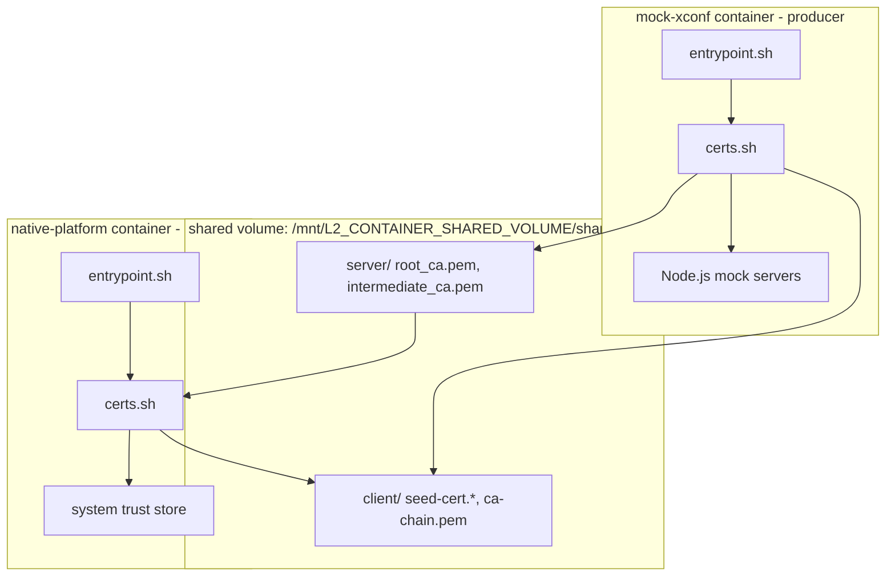

# Certificate Infrastructure — Architecture Overview

## Overview

The `docker-device-mgt-service-test` environment validates TLS and mutual-TLS
behavior on RDK devices using two containers that share a bind-mounted volume.
`mock-xconf` plays the role of the certificate authority and TLS server;
`native-platform` plays the role of the RDK client. All PKI material is
exchanged as files on the shared volume — the containers never invoke each
other's certificate scripts.

## Component Diagram



## The Two Roles

| Container | Role | Responsibilities |
|-----------|------|------------------|
| `mock-xconf` | Producer / CA / server | Generates the server PKI (`Test-RDK-root` → `Test-RDK-server-ICA` → `mockxconf`), a short-lived seed client cert, and — when mTLS is on — imports the client CA chain into its trust store. Serves the xconf mock endpoints over TLS. |
| `native-platform` | Consumer / client | Imports the server root + intermediate CA into the system trust store, and — when mTLS is on — generates its own client PKI (`Test-RDK-client-ICA` → `rdkclient`) and exports the client CA chain back for `mock-xconf` to trust. |

## Cert-Exchange Sequence (baseline, `ENABLE_MTLS=true`)

```mermaid
sequenceDiagram
    participant MX as mock-xconf/certs.sh
    participant SV as shared_certs volume
    participant NP as native-platform/certs.sh

    MX->>MX: generate server PKI (CN=mockxconf)
    MX->>SV: write server/root_ca.pem + server/intermediate_ca.pem
    MX->>MX: generate seed client cert (1-day validity)
    MX->>SV: write client/seed-cert.{key,pem,p12}

    NP->>SV: wait for server/root_ca.pem
    SV-->>NP: root_ca.pem present
    NP->>NP: import root + intermediate CA, update-ca-certificates
    NP->>NP: generate client PKI (CN=rdkclient)
    NP->>SV: write client/ca-chain.pem

    MX->>SV: wait for client/ca-chain.pem
    SV-->>MX: ca-chain.pem present
    MX->>MX: append client + server CA chains to trust store

    Note over MX,NP: Both trust stores now complete; mTLS handshakes succeed
```

## Startup & Synchronization

Both containers start at the same time under Docker Compose. Ordering is
enforced *inside* the containers, not by the orchestrator:

1. `mock-xconf/entrypoint.sh` runs `certs.sh` first, then launches the Node.js
   mock servers. If `certs.sh` exits non-zero, startup aborts.
2. `native-platform/certs.sh` waits for `server/root_ca.pem` before importing
   trust anchors, and (when mTLS is on) exports `client/ca-chain.pem`.
3. `mock-xconf/certs.sh` waits for `client/ca-chain.pem` before completing its
   trust-store setup.

These mutual waits (the **readiness sentinels**) are the only synchronization
mechanism; there are no fixed sleeps between the containers.

## Shared-Volume Layout

```
/mnt/L2_CONTAINER_SHARED_VOLUME/shared_certs/
├── server/
│   ├── root_ca.pem            # Test-RDK-root  (consumed + deleted by native-platform)
│   └── intermediate_ca.pem    # Test-RDK-server-ICA (consumed + deleted)
└── client/
    ├── seed-cert.key          # seed device key  (600)
    ├── seed-cert.pem          # seed device cert (644)
    ├── seed-cert.p12          # seed device bundle (644)
    └── ca-chain.pem           # client CA chain  (consumed + deleted by mock-xconf)
```

Files marked "consumed + deleted" are removed from the shared volume by the
importing side once installed, so a re-run starts from a clean state.

## See Also

- [PKI Hierarchy](pki-hierarchy.md) — the CA trees in detail
- [mock-xconf/certs.sh walkthrough](../certs/mock-xconf-certs.md)
- [native-platform/certs.sh walkthrough](../certs/native-platform-certs.md)
- [Mutual TLS](../certs/mtls.md)
- [Compose & Ports](../integration/compose-and-ports.md)
