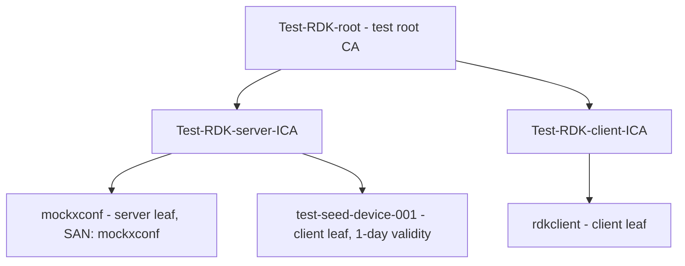

# PKI Hierarchy

## Overview

The baseline test infrastructure uses the `rdk-cert-config` generator scripts
(invoked from each container's `certs.sh` via `/etc/pki/scripts/`) to build a
small set of certificate authorities under a single test root. This page
describes the CA trees, the leaf certificates issued from them, and where each
artifact lives on disk.

All certificates are **test-only** and short-lived. Nothing here is intended for
production use.

## Certificate Authorities

All CAs derive from one test root, `Test-RDK-root`, with two intermediates —
one for server certs and one for client certs:



| CA | Issued by | Purpose |
|----|-----------|---------|
| `Test-RDK-root` | self-signed | Test root of trust for the whole environment |
| `Test-RDK-server-ICA` | `Test-RDK-root` | Signs the `mockxconf` server cert and the seed device cert |
| `Test-RDK-client-ICA` | `Test-RDK-root` | Signs the `rdkclient` mTLS client cert |

## Leaf Certificates

| Leaf | Signed by | CN / SAN | Generated in | Purpose |
|------|-----------|----------|--------------|---------|
| `mockxconf` server cert | `Test-RDK-server-ICA` | CN/SAN `mockxconf` | `mock-xconf/certs.sh` | TLS server identity for the xconf mocks |
| `test-seed-device-001` | `Test-RDK-server-ICA` | `test-seed-device-001` | `mock-xconf/certs.sh` (RDK-61060) | Short-lived seed cert consumed by the xPKI certifier flow |
| `rdkclient` | `Test-RDK-client-ICA` | `rdkclient` | `native-platform/certs.sh` | mTLS client identity presented by the device |

## On-Disk Layout

The generators write under `/etc/pki/<ROOT_CA_NAME>/<ICA_NAME>/` inside each
container:

```
/etc/pki/Test-RDK-root/
├── certs/Test-RDK-root.pem
├── Test-RDK-server-ICA/
│   ├── certs/
│   │   ├── Test-RDK-server-ICA.pem
│   │   ├── mockxconf.pem
│   │   ├── test-seed-device-001.pem
│   │   └── test-seed-device-001.p12
│   └── private/
│       ├── mockxconf.key
│       └── test-seed-device-001.key
└── Test-RDK-client-ICA/            # native-platform only
    ├── certs/rdkclient.pem
    ├── certs/rdkclient.p12
    ├── private/rdkclient.key
    └── Test-RDK-client-ICA_chain.pem
```

## Trust Relationships

Because the server leaf and the client leaf are signed by **different
intermediates** under the same root, each side must install the other side's CA
chain to complete verification:

- `native-platform` installs `Test-RDK-root` + `Test-RDK-server-ICA` so it can
  verify the `mockxconf` server cert.
- `mock-xconf` installs the client CA chain (`Test-RDK-client-ICA` and, per the
  script, the server ICA + root as well) so it can verify the `rdkclient`
  client cert during mTLS.

See [Trust flow in the mTLS page](mtls.md#trust-flow) for the exact
concatenation order used to build each trust store.

## Generator Scripts

These live in `rdk-cert-config` and are surfaced inside the images at
`/etc/pki/scripts/`:

| Script | Used by | Produces |
|--------|---------|----------|
| `generate_test_rdk_certs.sh --type server --cn mockxconf` | mock-xconf | Server PKI (root, server ICA, `mockxconf` leaf) |
| `create_leaf_cert.sh --ca-name Test-RDK-server-ICA ...` | mock-xconf | Seed device leaf (`test-seed-device-001`) |
| `generate_test_rdk_certs.sh --type client --cn rdkclient` | native-platform | Client PKI (client ICA, `rdkclient` leaf, chain) |

## See Also

- [Architecture Overview](overview.md)
- [mock-xconf/certs.sh walkthrough](../certs/mock-xconf-certs.md)
- [native-platform/certs.sh walkthrough](../certs/native-platform-certs.md)
- [Mutual TLS](../certs/mtls.md)
