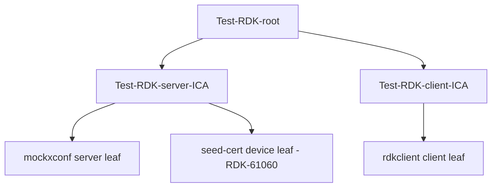
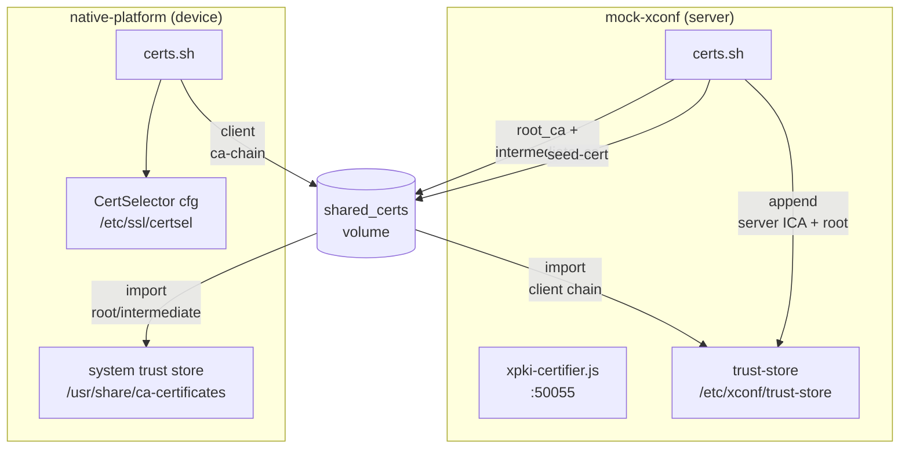
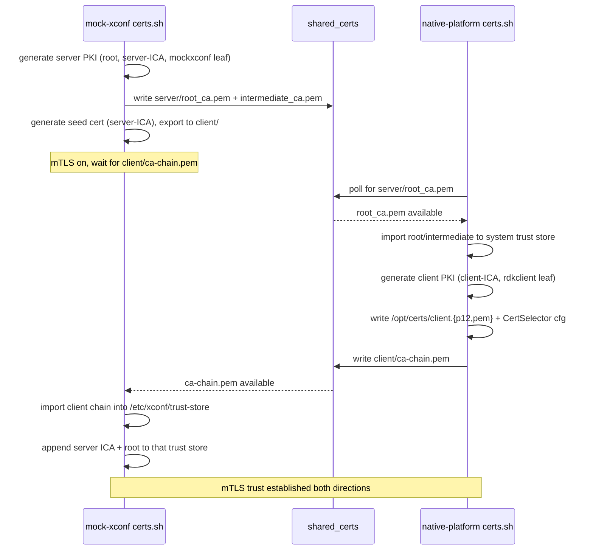

# Certificate Architecture

## Overview

The harness builds a test PKI at runtime and uses it to establish mTLS between
the **native-platform** (device/client) and **mock-xconf** (server/cloud)
containers. Certificates are generated by the
[rdk-cert-config](https://github.com/rdkcentral/rdk-cert-config) scripts and
exchanged through a shared Docker volume. No certificates are stored in the
container images.

## PKI hierarchy

All CAs and leaf certificates are rooted at a single test root, `Test-RDK-root`,
with separate intermediate CAs (ICAs) for the server and client sides. The
naming follows the rdk-cert-config layout under `/etc/pki/`.

- **Server leaf** (`mockxconf`) — used for all mock-xconf HTTPS endpoints.
- **Seed leaf** (`test-seed-device-001`) — short-lived (1 day) device identity
  used to bootstrap the xPKI certificate-procurement flow. Signed by the
  **server** ICA (a deliberate simplification — no separate xPKI root).
- **Client leaf** (`rdkclient`) — the device's operational client certificate
  presented during mTLS to mock-xconf.

> Because the server leaf and client leaf descend from **different ICAs**, each
> side must import the *other* side's CA chain to complete verification. This is
> why the mTLS trust flow is bidirectional (see below).

## Container roles and data flow

## The bidirectional mTLS handshake

Certificate exchange is **file-based** and **ordered**. Each side runs a
wait-loop against the shared volume, so the containers must be brought up
together.

### Why "up together" is required

- `mock-xconf/certs.sh` blocks in a `while [ ! -f .../client/ca-chain.pem ]`
  loop once `ENABLE_MTLS=true`.
- `native-platform/certs.sh` blocks in a `while [ ! -f .../server/root_ca.pem ]`
  loop (guarded by a DNS check that `mockxconf` resolves).
- Neither loop has a timeout, so a missing peer causes an indefinite wait.
  Start both with a single `docker compose up -d`.

## Trust stores

| Container | Trust store | Populated with |
| --------- | ----------- | -------------- |
| native-platform | `/usr/share/ca-certificates/` (+ `update-ca-certificates --fresh`) | mock-xconf **server** root CA (and intermediate if present) |
| mock-xconf | `/etc/xconf/trust-store/ca-chain.pem` | native-platform **client** CA chain, with the server ICA + root appended so server-signed operational certs also verify |

## Security posture

- Private keys are written `chmod 600`; public certs/chains `chmod 644`.
- The **xPKI certifier does not enforce mTLS** — by design, since clients need a
  certificate *before* they can present one. See [xpki-certifier.md](xpki-certifier.md).
- Every CA and cert here is **test-only** (`Test-RDK-*`). Do not reuse anywhere
  near production.

## See Also

- [Certificate Lifecycle](certificate-lifecycle.md)
- [Shared-Volume Contract](shared-volume-contract.md)
- [Configuration Reference](configuration.md)
- [xPKI Certifier Service](xpki-certifier.md)
