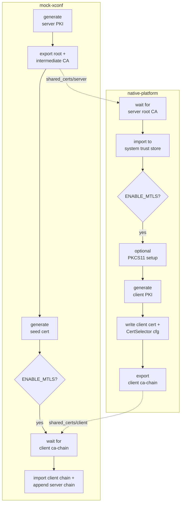

# Certificate Lifecycle

This document walks through the ordered steps each container performs to
generate, exchange, and trust certificates. It reflects the behaviour of
[mock-xconf/certs.sh](../../mock-xconf/certs.sh) and
[native-platform/certs.sh](../../native-platform/certs.sh) as invoked by their
respective `entrypoint.sh` scripts.

Both `entrypoint.sh` scripts call `certs.sh` **before** starting any service and
abort the container if it returns non-zero:

```sh
/usr/local/bin/certs.sh
CERTS_RC=$?
if [ "$CERTS_RC" -ne 0 ]; then
    echo "[entrypoint] Certificate setup failed with exit code $CERTS_RC; aborting startup."
    exit "$CERTS_RC"
fi
```

## mock-xconf (server) sequence

1. **Read toggles.** `ENABLE_MTLS` (default `false`).
2. **Generate server PKI** via
   `generate_test_rdk_certs.sh --type server --cn "mockxconf"`, producing under
   `/etc/pki/Test-RDK-root/Test-RDK-server-ICA/`:
   - server key `private/mockxconf.key`
   - server cert `certs/mockxconf.pem`
   - plus `Test-RDK-root.pem` and `Test-RDK-server-ICA.pem`
   Each artifact is validated non-empty; a missing file aborts with exit 1.
3. **Install server cert** into `/etc/xconf/certs/`:
   - `mock-xconf-server-key.pem` (`chmod 600`)
   - `mock-xconf-server-cert.pem`
4. **Export CAs** to the shared volume for the device:
   - `shared_certs/server/root_ca.pem`
   - `shared_certs/server/intermediate_ca.pem`
5. **Generate the seed certificate** (RDK-61060) with
   `create_leaf_cert.sh --cert-name test-seed-device-001 --ca-name Test-RDK-server-ICA --validity 1 --type client`
   and export to `shared_certs/client/`:
   - `seed-cert.pem` / `seed-cert.p12` (`chmod 644`)
   - `seed-cert.key` (`chmod 600`)
   > This runs **before** the mTLS wait so the xPKI certifier can start signing
   > immediately.
6. **If `ENABLE_MTLS=true`, wait for the client chain:**
   `while [ ! -f shared_certs/client/ca-chain.pem ]; do sleep 1; done`
7. **Import the client chain** into `/etc/xconf/trust-store/ca-chain.pem`, delete
   it from the shared volume, then **append the server ICA + root** to the same
   trust store (so operational certs signed by the server ICA also verify).

## native-platform (device) sequence

1. **Prepare directories** — `shared_certs/` and system trust store
   `/usr/share/ca-certificates/`.
2. **DNS gate** — only import the server CA if `mockxconf` resolves
   (`getent ahosts "$MOCKXCONF_HOST"`); `MOCKXCONF_HOST` defaults to `mockxconf`.
   Verifies `/usr/sbin/update-ca-certificates` exists (aborts if not).
3. **Wait for the server root CA:**
   `while [ ! -f shared_certs/server/root_ca.pem ]; do sleep 1; done`
4. **Import into the system trust store:**
   - copy `root_ca.pem` → `mock-xconf-root-ca.pem` (`chmod 644`)
   - copy `intermediate_ca.pem` if present
   - register names in `/etc/ca-certificates.conf`
   - `update-ca-certificates --fresh`
   - remove the imported server CAs from the shared volume
5. **Read toggles.** `ENABLE_MTLS`, `ENABLE_PKCS11` (both default `false`).
6. **If `ENABLE_MTLS=true`:**
   1. *(Optional PKCS#11 setup — see [pkcs11.md](pkcs11.md).)* When
      `ENABLE_PKCS11=true`, run `setup-pkcs11-openssl.sh` once (guarded by the
      `/usr/local/openssl-pkcs11-ready` sentinel).
   2. **Generate client PKI** via
      `generate_test_rdk_certs.sh --type client --cn "rdkclient"`, producing
      under `/etc/pki/Test-RDK-root/Test-RDK-client-ICA/`: `rdkclient.pem`,
      `rdkclient.key`, `rdkclient.p12`, and `Test-RDK-client-ICA_chain.pem`.
      All four are validated non-empty.
   3. **Assemble runtime certs** in `/opt/certs/`:
      - `client.pem` = client cert + key concatenated
      - `client.p12` = copied from the generated P12
   4. *(PKCS#11 only)* Generate `reference.p12` with a sentinel key via
      `create_reference_p12`, then run `setup-pkcs11.sh` to import into SoftHSM.
   5. **Write the CertSelector config** `/etc/ssl/certsel/certsel.cfg`
      (see [configuration.md](configuration.md#certselector-configuration)).
   6. **Export the client CA chain** to `shared_certs/client/ca-chain.pem` for
      mock-xconf, validating it is non-empty.

## Lifecycle diagram



## Healthy log signature

A successful mTLS bring-up shows, on **mock-xconf**:

```
[certs] Server root and intermediate CA certificates copied to shared volume for native-platform
[certs] ✓ Seed certificate (1 day validity) generated and exported to shared volume
[certs] Client certificate chain found - importing to trust store
[certs] Server CA chain (ICA + root) appended to trust store for operational certificates
[certs] mTLS certificate trust flow established
```

and on **native-platform**:

```
[certs] System CA trust store updated
[certs] Client certificates generated and copied to /opt/certs
[certs] Client CA chain copied to shared volume for mock-xconf
[certs] mTLS certificate trust flow established
```

## See Also

- [Architecture](architecture.md)
- [Shared-Volume Contract](shared-volume-contract.md)
- [PKCS#11 / SoftHSM](pkcs11.md)
- [Troubleshooting](troubleshooting.md)
