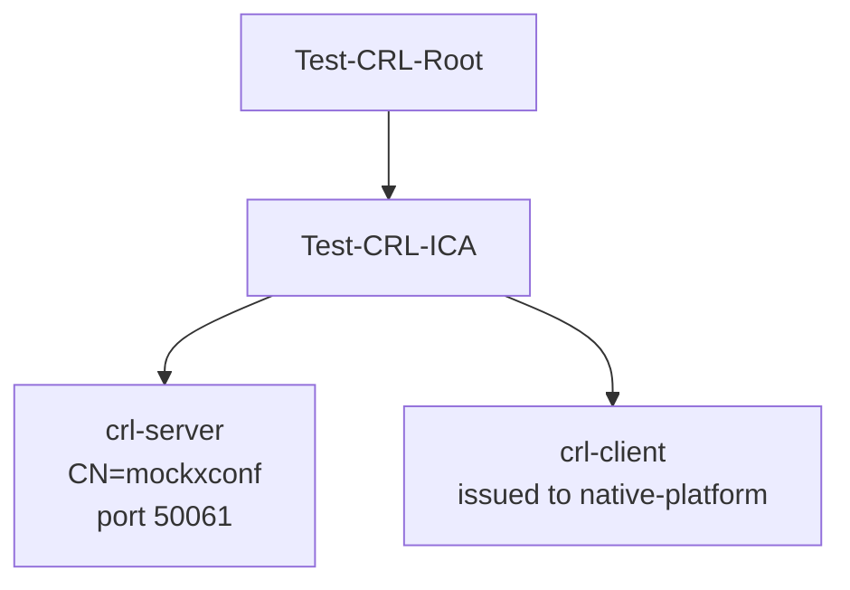
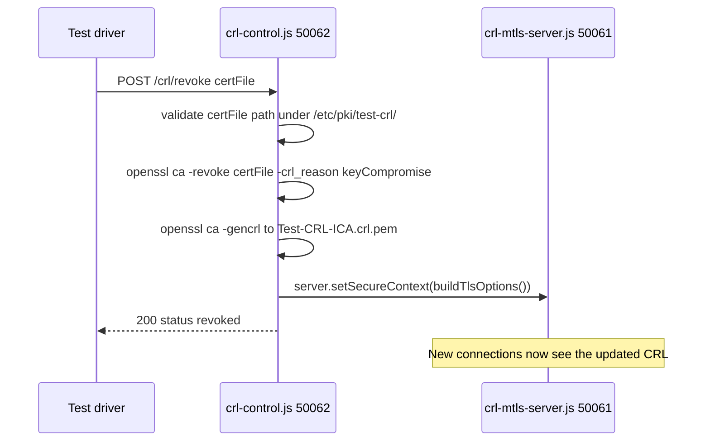

# CRL mTLS and Live Revocation

## Overview

The harness can prove that a client certificate accepted over mutual TLS is
**rejected the moment it is revoked**, with no server restart. This is controlled
by `ENABLE_CRL_L3` (default `false`) and, like the baseline mTLS flow, only
matters when `ENABLE_MTLS=true`. When the flag is unset, none of the servers or
PKI below are created.

It is implemented by two cooperating servers that share a single Node.js process
inside **mock-xconf**:

| Server | Port | Transport | Role |
|--------|------|-----------|------|
| [mock-xconf/crl-mtls-server.js](../../mock-xconf/crl-mtls-server.js) | 50061 | HTTPS + mTLS | Enforces client certs against the active CRL |
| [mock-xconf/crl-control.js](../../mock-xconf/crl-control.js) | 50062 | Plain HTTP | Test-control endpoint that revokes a cert and hot-reloads the CRL |

## PKI

The CRL PKI is generated by `generate_crl_test_certs.sh` (from
[rdk-cert-config](https://github.com/rdkcentral/rdk-cert-config)), driven by the
`ENABLE_CRL_L3` block of [mock-xconf/certs.sh](../../mock-xconf/certs.sh):



- **Server material** → `/etc/xconf/certs/crl/` inside `mock-xconf`
  (`crl-server.key`, `crl-server.pem`, the CA certs, and the CRL files).
- **Client material** → the shared volume at `shared_certs/crl-client/`
  (`crl-client.pem`, `crl-client.key`, `crl-client.p12`, `crl-ica-chain.pem`,
  `Test-CRL-Root.pem`), later copied by
  [native-platform/certs.sh](../../native-platform/certs.sh) into
  `native-platform:/opt/certs/crl/`.

## Trust and CRL configuration

`crl-mtls-server.js` builds its TLS options from disk (`buildTlsOptions()`),
requesting and requiring a client certificate:

- `requestCert: true` and `rejectUnauthorized: true` — clients without a valid,
  non-revoked cert are rejected at the **TLS layer**.
- `cert` sends the **full server chain** (leaf + ICA concatenated), so clients
  can verify the server without needing `Test-CRL-ICA` pre-installed.
- `ca` includes both `Test-CRL-Root` and (when present) `Test-XS-NewRoot`, so the
  same server also serves the [cross-signed bridge](cross-signed-pki.md)
  scenarios.
- `crl` includes the ICA CRL, a static empty **root** CRL, and any XS CRLs. The
  root/XS CRLs are required because OpenSSL 3's `CRL_CHECK_ALL` verifies every
  certificate in the chain, not just the leaf.

## Revocation flow

The control endpoint accepts a single request:

```
POST http://mockxconf:50062/crl/revoke
Content-Type: application/json

{ "certFile": "/etc/pki/test-crl/.../crl-client.pem" }
```

On receipt, `crl-control.js`:



Revocation is **permanent for the container's lifetime** — there is no reset
endpoint, matching real-world CRL semantics.

### Why one process

The circular `require` between the two files (`crl-mtls-server` → `crl-control`
→ `crl-mtls-server`) is deliberate and safe: `crl-mtls-server` assigns
`module.exports` before requiring `crl-control`. Running both in one process lets
the control endpoint call `setSecureContext()` directly, so the new CRL takes
effect on the very next handshake without a restart or IPC.

## Security considerations

- **Path validation.** `certFile` must be an absolute path to a regular file
  under `/etc/pki/test-crl/`; symlinks and path-traversal are rejected before
  `openssl` is invoked.
- **Network isolation.** `compose.yaml` binds the 50062 control port to
  `127.0.0.1` only, so it is not reachable from the wider network.
- **No shell.** `openssl` runs via `execFileSync` with an argument array (no
  shell expansion), with a bounded timeout and output buffer.
- **Serialized operations.** A `busy` flag serialises revocations so a fast retry
  cannot race a still-running `openssl` call (`503 busy` is returned).
- **Body cap.** The request body is capped (`413 payload too large`) to guard the
  HTTP endpoint against memory exhaustion.
- **Test-only.** All CAs and certs here are `Test-CRL-*` — never reuse in
  production. Private key paths and passphrases never appear in responses or logs.

## Enabling it

Set the flag on the `mock-xconf` and `native-platform` services (both are set to
`true` in [compose.yaml](../../compose.yaml)):

```yaml
environment:
  - ENABLE_MTLS=true
  - ENABLE_CRL_L3=true
```

## Verification

The revocation behaviour is asserted by `test_l3_crl_valid_then_revoked` in
`rdk-cert-config`'s `test/functional-tests/tests/test_l3_crl_xsign.py`, which:

1. Connects with a valid `crl-client` cert and expects success (`CURLE_OK`).
2. Calls `POST /crl/revoke`, then re-connects with the **same** cert and expects
   the TLS receive to fail (`CURLE_RECV_ERROR`).

Manual check from inside `native-platform` (valid case):

```sh
curl -sv https://mockxconf:50061/health \
  --cert /opt/certs/crl/crl-client.pem \
  --key  /opt/certs/crl/crl-client.key
# -> HTTP 200 {"status":"ok"}
```

## Failure modes

| Symptom | Likely cause |
|---------|--------------|
| Valid cert rejected at startup | Client CRL assets not yet copied, or CRL file missing (server exits on missing file) |
| Revoked cert still accepted | `setSecureContext()` not applied — check that both servers share one process |
| `503 busy` on revoke | A previous revoke is still running; retry after a short delay |
| `400 certFile path not allowed` | `certFile` is outside `/etc/pki/test-crl/`, relative, or a symlink |

## See Also

- [Cross-Signed PKI](cross-signed-pki.md) — bridge scenarios served on the same 50061 port
- [OCSP Stapling](ocsp-stapling.md) — the alternative revocation-status mechanism
- [Certificate Architecture](architecture.md) — baseline PKI and mTLS handshake
- [Configuration Reference](configuration.md) — env vars and ports
