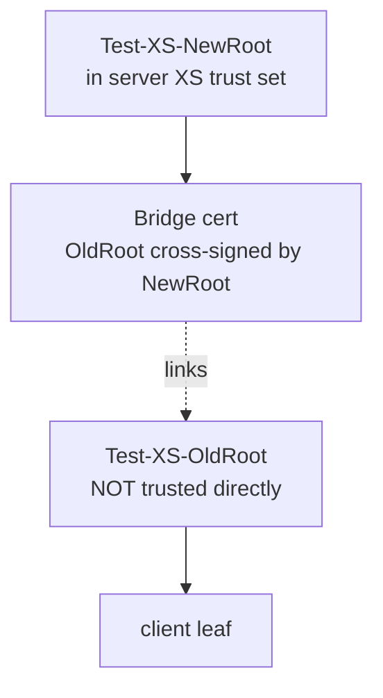

# Cross-Signed (Bridge) PKI

## Overview

Cross-signing lets a device that was issued under an **old** root of trust keep
authenticating after the fleet migrates to a **new** root, by presenting a
short-lived *bridge* certificate that links the old root to the new one. This
scenario proves the server trusts a valid bridge and rejects a missing or expired
one.

It is controlled by `ENABLE_CRL_L3` (default `false`) and is served by the same
mTLS server as [CRL mTLS and Live Revocation](crl-mtls.md), on port 50061. The
PKI is generated by `generate_cross_signed_test_certs.sh` (from
[rdk-cert-config](https://github.com/rdkcentral/rdk-cert-config)), driven by the
`ENABLE_CRL_L3` block of [mock-xconf/certs.sh](../../mock-xconf/certs.sh) with
`XS_EXPIRY=1`. All P12 bundles are written to the shared volume at
`shared_certs/xs-client/`.

## Trust model



For **XS validation**, the server's trust set contains `Test-XS-NewRoot` only
(`Test-XS-OldRoot` is not trusted directly). A client issued under
`Test-XS-OldRoot` therefore validates *only* if its presented chain includes the
bridge certificate that `Test-XS-NewRoot` cross-signed for `Test-XS-OldRoot`.
(The server also always trusts the CRL-PKI roots for the
[revocation scenarios](crl-mtls.md); the two trust anchors coexist in its `ca`
set.)

## The three client bundles

| Bundle | Chain presented | Expected result |
|--------|-----------------|-----------------|
| `client-xsign.p12` | leaf → OldRoot **+ valid bridge → NewRoot** | Accepted |
| `client-old.p12` | leaf → OldRoot (no bridge) | Rejected — server does not trust OldRoot directly |
| `client-expxs.p12` | leaf → OldRoot **+ expired bridge** | Rejected — bridge is outside its validity window |

`XS_EXPIRY=1` gives the still-valid bridge a 1-day lifetime; the generator also
produces a truly-expired bridge and re-bundles `client-expxs.p12` with it.

## Readiness sentinel

`client-expxs.p12` is written **twice** by the generator (first with the valid
bridge, then again with the expired bridge). To avoid copying the wrong version,
[native-platform/certs.sh](../../native-platform/certs.sh) waits on
**`xs-client/NewRoot.pem`**, which the generator writes **last**, after the
expired-bridge rewrite is complete:

```sh
while [ ! -f "${SHARED_CERTS_DIR}/xs-client/NewRoot.pem" ]; do sleep 1; done
```

It then copies the three P12 bundles and `NewRoot.pem` into `/opt/certs/xs/`
(private bundles `chmod 600`), and installs `Test-XS-NewRoot` into the system
trust store so `curl` can verify the server certificate.

## Chain validation and CRLs

Because the server enforces OpenSSL 3 `CRL_CHECK_ALL`, every CA in the
cross-signed chain must have a CRL available. The generator emits an empty CRL
for each XS CA into `shared_certs/xs-client/*.crl.pem`, which
`crl-mtls-server.js` loads alongside the CRL-PKI CRLs.

## Enabling it

Set the flag on the `mock-xconf` and `native-platform` services (both are set to
`true` in [compose.yaml](../../compose.yaml)):

```yaml
environment:
  - ENABLE_MTLS=true
  - ENABLE_CRL_L3=true
```

## Verification

Asserted by three tests in `rdk-cert-config`'s
`test/functional-tests/tests/test_l3_crl_xsign.py`:

| Test | l3testapp scenario | Bundle | Expected |
|------|--------------------|--------|----------|
| `test_l3_xsign_bridge_succeeds` | 2 | `client-xsign.p12` | `CURLE_OK` |
| `test_l3_xsign_no_bridge_fails` | 3 | `client-old.p12` | `CURLE_RECV_ERROR` |
| `test_l3_xsign_expired_bridge_fails` | 4 | `client-expxs.p12` | `CURLE_RECV_ERROR`, and must complete in under 5s (no TLS retry hang) |

## Failure modes

| Symptom | Likely cause |
|---------|--------------|
| Bridge client rejected | `Test-XS-NewRoot` not in the server `ca` set, or XS CRLs missing (`CRL_CHECK_ALL` fails) |
| Expired-bridge test hangs | Client retried the handshake; the generator/expiry wiring must produce a cleanly-expired bridge |
| Copied the wrong `client-expxs.p12` | Consumer waited on the P12 instead of the `NewRoot.pem` sentinel |

## See Also

- [CRL mTLS and Live Revocation](crl-mtls.md) — the shared 50061 server and its trust/CRL setup
- [Certificate Architecture](architecture.md) — baseline PKI hierarchy
- [Shared-Volume Contract](shared-volume-contract.md) — file exchange rules
