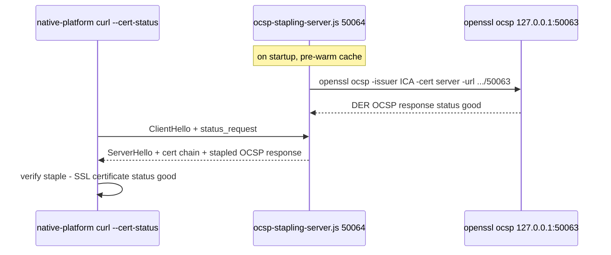

# OCSP Stapling

## Overview

OCSP stapling lets the **server** attach ("staple") a signed, time-stamped OCSP
response to its TLS handshake, so the client learns the certificate's revocation
status without contacting the OCSP responder itself. This scenario proves the
server staples a valid `good` response, and that a client requiring a staple is
rejected when connecting to a server that does not staple.

It is controlled by `ENABLE_CRL_L3` (default `false`). When enabled, two
processes cooperate inside **mock-xconf**, both started by
[mock-xconf/entrypoint.sh](../../mock-xconf/entrypoint.sh):

| Process | Port | Role |
|---------|------|------|
| `openssl ocsp` responder | 50063 | Answers OCSP queries from the CRL-ICA index (internal) |
| [mock-xconf/ocsp-stapling-server.js](../../mock-xconf/ocsp-stapling-server.js) | 50064 | One-way TLS server that fetches, caches, and staples the OCSP response |

## How it works



- **One-way TLS.** The stapling server sets `requestCert: false` — it tests the
  server→client direction (stapling), not mTLS.
- **Full server chain.** The server sends the leaf certificate concatenated with
  the ICA, so clients can verify the server without needing `Test-CRL-ICA`
  pre-installed.
- **Internal responder address.** The stapling server queries the responder at
  `http://127.0.0.1:50063`, because the container hostname `mockxconf` only
  resolves from *other* containers, not from within `mock-xconf` itself.
- **Cache and refresh.** The DER response is cached and refreshed every
  **30 minutes** (`REFRESH_INTERVAL_MS`), per the architecture owner's spec. The
  cache is warmed synchronously at `listen()` so the first client does not pay a
  cold-fetch delay; the `OCSPRequest` handler serves the cached value.
- **Staple regardless of status.** `openssl ocsp -respout` emits a valid DER
  response for `good`/`revoked`/`unknown` alike; the server staples whatever it
  gets and logs the parsed status, so negative cases still receive a staple.
- **Temp-file hygiene.** Each fetch writes a uniquely-named DER file
  (`pid + timestamp + random`) and cleans it up on every path (success and
  error) to avoid `/tmp` buildup.

## Startup ordering

The responder (50063) must be listening before the stapling server warms its
cache, so `entrypoint.sh` starts `openssl ocsp` first, pauses briefly, then
launches `ocsp-stapling-server.js`. If the OCSP PKI files are missing, both OCSP
servers are skipped with a warning (the rest of the certificate flow still runs).

## Why ports 50063 / 50064 are internal-only

- **50063** (`openssl ocsp`) is queried from `127.0.0.1` inside the container. It
  is not published to the host and, because the `openssl` responder binds
  IPv4-only, never appears in `/proc/net/tcp6`.
- **50064** is reached container-to-container over the Docker network by the test
  client, so it does not need a host publish either.

Both remain `EXPOSE`d in the Dockerfile for documentation only.

## Enabling it

Set the flag on the `mock-xconf` and `native-platform` services (both are set to
`true` in [compose.yaml](../../compose.yaml)):

```yaml
environment:
  - ENABLE_MTLS=true
  - ENABLE_CRL_L3=true
```

## Verification

Asserted by two tests in `rdk-cert-config`'s
`test/functional-tests/tests/test_l3_crl_xsign.py`:

| Test | l3testapp scenario | Connects to | Expected |
|------|--------------------|-------------|----------|
| `test_l3_ocsp_staple_present` | 5 | 50064 (stapling) with `SSL_VERIFYSTATUS=1` | `CURLE_OK` — a valid `good` staple was returned |
| `test_l3_ocsp_staple_absent_rejected` | 6 | 50061 (CRL mTLS, no stapling) with `SSL_VERIFYSTATUS=1` | `CURLE_SSL_INVALIDCERTSTATUS` — no staple |

Scenario 6 is the negative control that proves scenario 5 is meaningful and not a
false positive.

Manual check from inside `native-platform`:

```sh
curl --cert-status -sv https://mockxconf:50064/health
# TLS trace contains: SSL certificate status: good
```

## Failure modes

| Symptom | Likely cause |
|---------|--------------|
| Cache not warmed at startup | Responder (50063) not up yet — the server retries on first request |
| `openssl ocsp error` in logs | Responder unreachable, or OCSP PKI files missing under `/etc/xconf/certs/ocsp/` |
| Scenario 5 fails with invalid status | Staple missing/stale; check the responder and the AIA URL |

## See Also

- [CRL mTLS and Live Revocation](crl-mtls.md) — the non-stapling server used as the negative control
- [Configuration Reference](configuration.md) — env vars and ports
