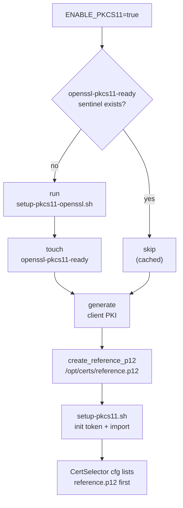

# PKCS#11 / SoftHSM Integration

## Overview

The device (native-platform) can optionally store its client private key in a
**SoftHSM** token and access it through **PKCS#11** rather than as a file on
disk. This exercises the hardware-backed key path used on real devices. It is
controlled by `ENABLE_PKCS11` (default `false`) and only takes effect when
`ENABLE_MTLS=true`.

This flow is implemented in
[native-platform/certs.sh](../../native-platform/certs.sh) using scripts
installed from [rdk-cert-config](https://github.com/rdkcentral/rdk-cert-config).

## Components installed in the image

From the native-platform Dockerfile (rdk-cert-config install step):

| Artifact | Purpose |
| -------- | ------- |
| `/usr/local/bin/setup-pkcs11-openssl.sh` | Applies the OpenSSL PKCS#11 patch / provider setup |
| `/usr/local/bin/setup-pkcs11.sh` | Initializes the SoftHSM token and imports certs |
| `/usr/local/share/cert-scripts/create_reference_p12` | Builds a reference P12 with a sentinel key |
| `/etc/softhsm2.conf` | SoftHSM configuration |
| `/opt/patches/pkcs11_migration_support_p12.patch` | OpenSSL PKCS#11 P12 support patch |

## Flow (when `ENABLE_PKCS11=true`)



1. **OpenSSL PKCS#11 setup (once).** If `/usr/local/openssl-pkcs11-ready` does
   not exist, run `setup-pkcs11-openssl.sh`. On success, the sentinel file is
   created so subsequent container starts skip the work. Failure aborts startup
   (exit 1).
2. **Generate the client PKI** (same as the non-PKCS#11 path).
3. **Reference P12.** `create_reference_p12 <client-cert> /opt/certs/reference.p12 changeit`
   creates a P12 whose key is a **sentinel** — the real key lives in the token.
4. **Token setup.** `setup-pkcs11.sh` initializes the SoftHSM token and imports
   the certificate/key material. Failure aborts startup (exit 1).
5. **CertSelector precedence.** The reference (hardware-backed) cert is listed
   **first** in `/etc/ssl/certsel/certsel.cfg`, so it is preferred over the
   file-based P12:

   ```
   MTLS|SRVR_TLS,REFERENCE_P12,P12,file:///opt/certs/reference.p12,cfgOpsCert
   MTLS|SRVR_TLS,CLIENT_P12,P12,file:///opt/certs/client.p12,cfgOpsCert
   MTLS_PEM,CLIENT_PEM,PEM,file:///opt/certs/client.pem,cfgOpsCert
   ```

   When PKCS#11 is disabled, only the last two lines are written and
   `client.p12` is primary.

## The sentinel / caching pattern

`/usr/local/openssl-pkcs11-ready` is a marker file that records that the
(relatively expensive) OpenSSL PKCS#11 setup has completed. It makes the step
**idempotent** across container restarts: present ⇒ skip, absent ⇒ run. If you
need to force a re-run, delete the sentinel.

## Security considerations

- The reference P12 password (`changeit`) is a **test-only** placeholder.
- The point of this flow is that the operational private key is **not** a plain
  file — it is held by the token and referenced via PKCS#11.
- All material is test-only (`Test-RDK-*`); never reuse in production.

## Enabling it

Set both variables on the native-platform service (see
[configuration.md](configuration.md)):

```yaml
environment:
  - ENABLE_MTLS=true
  - ENABLE_PKCS11=true
```

## See Also

- [Certificate Lifecycle](certificate-lifecycle.md)
- [Configuration Reference](configuration.md#certselector-configuration)
- [Troubleshooting](troubleshooting.md)
