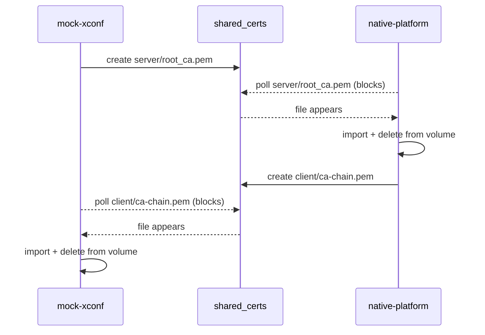

# Shared-Volume Contract

Certificate exchange between the two containers is **file-based** over a shared
Docker volume. Because there is no network handshake for this exchange, the set
of files, their producers/consumers, permissions, and cleanup rules effectively
form an **API contract**. This document captures that contract.

## Mount

Every service in [compose.yaml](../../compose.yaml) mounts the workspace root:

```yaml
volumes:
  - ../:/mnt/L2_CONTAINER_SHARED_VOLUME
```

The PKI exchange directory is:

```
/mnt/L2_CONTAINER_SHARED_VOLUME/shared_certs/
├── server/     # produced by mock-xconf, consumed by native-platform
└── client/     # ca-chain produced by native-platform; seed cert produced by mock-xconf
```

Both `certs.sh` scripts `mkdir -p` this directory, so either container may
create it first.

## File contract

| Path (under `shared_certs/`) | Producer | Consumer | Perms | Cleaned up by |
| ---------------------------- | -------- | -------- | ----- | ------------- |
| `server/root_ca.pem` | mock-xconf | native-platform | 644 | native-platform (after import) |
| `server/intermediate_ca.pem` | mock-xconf | native-platform | 644 | native-platform (after import) |
| `client/ca-chain.pem` | native-platform | mock-xconf | default | mock-xconf (after import) |
| `client/seed-cert.pem` | mock-xconf | native-platform (xPKI clients) | 644 | not cleaned up |
| `client/seed-cert.p12` | mock-xconf | native-platform (xPKI clients) | 644 | not cleaned up |
| `client/seed-cert.key` | mock-xconf | native-platform (xPKI clients) | 600 | not cleaned up |

### Cleanup semantics

- The **server CA files** and the **client chain** are deleted from the shared
  volume by their consumer immediately after import. This keeps the exchange
  idempotent and avoids leaking CA material longer than needed.
- The **seed certificate** is intentionally left in place — it is bootstrap
  material for the xPKI procurement flow and may be read multiple times.

## Ordering guarantees (wait-loops)

Synchronization is achieved with polling wait-loops. Neither loop has a timeout.

| Waiter | Waits for | Guard |
| ------ | --------- | ----- |
| native-platform `certs.sh` | `server/root_ca.pem` | only if `mockxconf` DNS resolves |
| mock-xconf `certs.sh` | `client/ca-chain.pem` | only if `ENABLE_MTLS=true` |



### Implications

- **Bring both containers up together** (`docker compose up -d`). Starting one
  alone will block indefinitely on the missing peer file.
- Because consumers delete the files after import, a **re-run** requires
  re-generation (the producer regenerates on the next container start).
- On a Windows host, a lingering `mockxconf` container can hold port 50060 after
  `down`; remove it (`docker rm -f mockxconf`) before re-`up`.

## See Also

- [Certificate Lifecycle](certificate-lifecycle.md)
- [Architecture](architecture.md)
- [Troubleshooting](troubleshooting.md)
