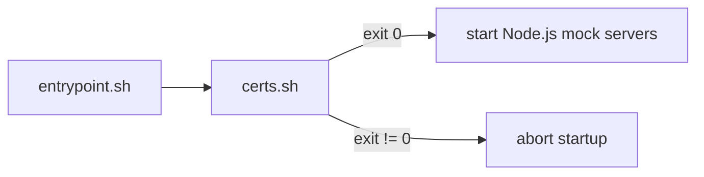

# `mock-xconf/certs.sh` — Producer Walkthrough

## Overview

`mock-xconf/certs.sh` runs from the container's `entrypoint.sh` before any mock
server starts. It generates the server PKI that identifies `mockxconf` over TLS,
produces a short-lived seed client certificate, and — when mTLS is enabled —
imports the client CA chain exported by `native-platform`. The script uses
`set -e`, so any failed step aborts container startup.

## Where It Runs



## Configuration

| Variable | Default | Effect |
|----------|---------|--------|
| `ENABLE_MTLS` | `false` | When `true`, waits for and imports the client CA chain to enable mutual TLS. |

Base directory: `SHARED_CERTS_DIR=/mnt/L2_CONTAINER_SHARED_VOLUME/shared_certs`.

## Flow

### 1. Generate the server certificate

```sh
/etc/pki/scripts/generate_test_rdk_certs.sh --type server --cn "mockxconf"
```

This builds `Test-RDK-root` → `Test-RDK-server-ICA` → `mockxconf`. The script
then verifies the four expected artifacts exist and are non-empty:

| Variable | Path |
|----------|------|
| `SERVER_KEY` | `/etc/pki/Test-RDK-root/Test-RDK-server-ICA/private/mockxconf.key` |
| `SERVER_CERT` | `/etc/pki/Test-RDK-root/Test-RDK-server-ICA/certs/mockxconf.pem` |
| `ROOT_CA_CERT` | `/etc/pki/Test-RDK-root/certs/Test-RDK-root.pem` |
| `ICA_CERT` | `/etc/pki/Test-RDK-root/Test-RDK-server-ICA/certs/Test-RDK-server-ICA.pem` |

### 2. Install and export server material

```sh
cp "$SERVER_KEY"  /etc/xconf/certs/mock-xconf-server-key.pem   # chmod 600
cp "$SERVER_CERT" /etc/xconf/certs/mock-xconf-server-cert.pem
cp "$ROOT_CA_CERT" "$SHARED_CERTS_DIR/server/root_ca.pem"
cp "$ICA_CERT"     "$SHARED_CERTS_DIR/server/intermediate_ca.pem"
```

The server key/cert go to `/etc/xconf/certs/` for the mock servers to present;
the root and intermediate CAs go to the shared volume for `native-platform` to
import.

### 3. Generate the seed certificate (RDK-61060)

```sh
/etc/pki/scripts/create_leaf_cert.sh \
    --cert-name "test-seed-device-001" \
    --ca-name   "Test-RDK-server-ICA" \
    --cn        "test-seed-device-001" \
    --validity  1 \
    --type      client
```

The seed cert (1-day validity) is signed by the server ICA and exported to the
shared volume for the xPKI certifier flow:

```sh
cp "$SEED_KEY"  "$SHARED_CERTS_DIR/client/seed-cert.key"   # chmod 600
cp "$SEED_CERT" "$SHARED_CERTS_DIR/client/seed-cert.pem"   # chmod 644
cp "$SEED_P12"  "$SHARED_CERTS_DIR/client/seed-cert.p12"   # chmod 644
```

This runs **before** the mTLS wait so that `xpki-certifier.js` (port 50055) can
start regardless of the mTLS toggle.

### 4. mTLS trust import (only when `ENABLE_MTLS=true`)

```sh
while [ ! -f "$SHARED_CERTS_DIR/client/ca-chain.pem" ]; do
    sleep 1
done
cp "$SHARED_CERTS_DIR/client/ca-chain.pem" /etc/xconf/trust-store/ca-chain.pem
rm -f "$SHARED_CERTS_DIR/client/ca-chain.pem"
cat "$ICA_CERT"     >> /etc/xconf/trust-store/ca-chain.pem
cat "$ROOT_CA_CERT" >> /etc/xconf/trust-store/ca-chain.pem
```

The client CA chain (exported by `native-platform`) is imported, then the server
ICA and root are appended. Both are needed because operational certs and client
certs are signed under different intermediates.

## Outputs Summary

| Artifact | Destination | Perms | Consumer |
|----------|-------------|-------|----------|
| Server key | `/etc/xconf/certs/mock-xconf-server-key.pem` | 600 | mock servers |
| Server cert | `/etc/xconf/certs/mock-xconf-server-cert.pem` | 644 | mock servers |
| Root CA | `shared_certs/server/root_ca.pem` | 644 | native-platform |
| Intermediate CA | `shared_certs/server/intermediate_ca.pem` | 644 | native-platform |
| Seed key/cert/p12 | `shared_certs/client/seed-cert.*` | 600/644 | xPKI flow |
| Trust store | `/etc/xconf/trust-store/ca-chain.pem` | — | mock servers (mTLS) |

## Failure Modes

| Symptom in logs | Cause |
|-----------------|-------|
| `ERROR: Expected certificate artifact missing or empty` | A generator step did not produce an expected file; startup aborts. |
| `Waiting for client certificates...` repeating forever | `ENABLE_MTLS=true` but `native-platform` never exported `client/ca-chain.pem`. |

## See Also

- [PKI Hierarchy](../architecture/pki-hierarchy.md)
- [native-platform/certs.sh walkthrough](native-platform-certs.md)
- [Mutual TLS](mtls.md)
