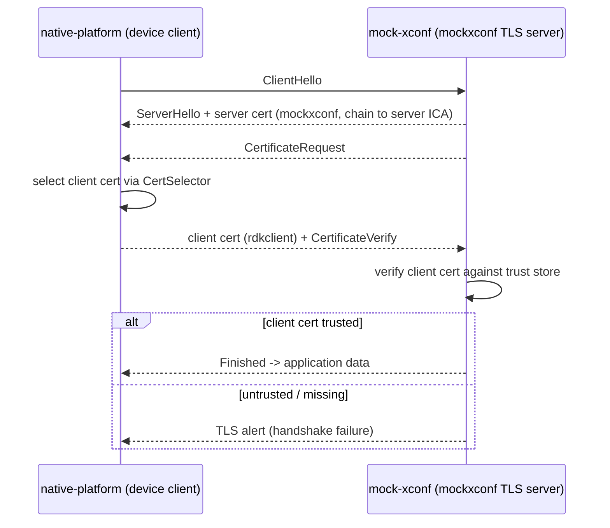

# Mutual TLS (mTLS)

## Overview

Mutual TLS is enabled by setting `ENABLE_MTLS=true` on both containers. In
addition to the server proving its identity to the client (ordinary TLS), the
client also presents a certificate that the server verifies. This exercises the
device's client-cert selection and presentation code against the `mockxconf`
server.

## Trust Flow

Because the server leaf and the client leaf are signed by **different
intermediates** under the same `Test-RDK-root`, each side must install the
other's CA chain:

```mermaid
graph LR
    subgraph native-platform
        NPtrust[system trust store:<br/>Test-RDK-root + Test-RDK-server-ICA]
        NPclient[client cert: rdkclient]
    end
    subgraph mock-xconf
        MXtrust[/etc/xconf/trust-store/ca-chain.pem:<br/>client CA chain + server ICA + root]
        MXserver[server cert: mockxconf]
    end

    MXserver -- verified by --> NPtrust
    NPclient -- verified by --> MXtrust
```

### How each trust store is built

- **native-platform** imports `server/root_ca.pem` + `server/intermediate_ca.pem`
  into `/usr/share/ca-certificates/` and runs `update-ca-certificates --fresh`.
- **mock-xconf** imports `client/ca-chain.pem` into
  `/etc/xconf/trust-store/ca-chain.pem`, then appends its own server ICA and root
  (see [mock-xconf/certs.sh §4](mock-xconf-certs.md#4-mtls-trust-import-only-when-enable_mtlstrue)).

## Handshake



## Client Certificate Selection

The device selects which client cert to present via the CertSelector config at
`/etc/ssl/certsel/certsel.cfg`. Baseline entries:

```
MTLS|SRVR_TLS,CLIENT_P12,P12,file:///opt/certs/client.p12,cfgOpsCert
MTLS_PEM,CLIENT_PEM,PEM,file:///opt/certs/client.pem,cfgOpsCert
```

With `ENABLE_PKCS11=true`, a hardware-token-backed `REFERENCE_P12` entry is tried
first, falling back to the file-based P12/PEM.

## Verification

Run inside the `native-platform` container against a live `mockxconf`:

**Positive — server cert is trusted (one-way TLS):**
```sh
curl -sf https://mockxconf:50051/ >/dev/null && echo "server trusted"
```

**Positive — present the client cert (mutual TLS):**
```sh
curl -sf \
  --cert /opt/certs/client.pem \
  https://mockxconf:<mtls-port>/ >/dev/null && echo "mTLS ok"
```

**Negative — omit the client cert on an mTLS endpoint:**
```sh
# Expected to FAIL the handshake, proving mutual auth is enforced.
curl -sf https://mockxconf:<mtls-port>/
echo "exit=$?"   # non-zero
```

> Replace `<mtls-port>` with the endpoint under test. The exact ports are listed
> in [Compose & Ports](../integration/compose-and-ports.md).

## Failure Modes

| Symptom | Cause |
|---------|-------|
| Client hangs at `Waiting for client certificates...` (mock-xconf) | native-platform never exported `client/ca-chain.pem`; check `ENABLE_MTLS` on the consumer. |
| `SSL certificate problem: unable to get local issuer certificate` on the client | Server CA import failed on native-platform (`update-ca-certificates`). |
| Server rejects the client with a TLS alert | `mock-xconf` trust store is missing the client CA chain. |

## See Also

- [Architecture Overview](../architecture/overview.md)
- [PKI Hierarchy](../architecture/pki-hierarchy.md)
- [mock-xconf/certs.sh](mock-xconf-certs.md)
- [native-platform/certs.sh](native-platform-certs.md)
