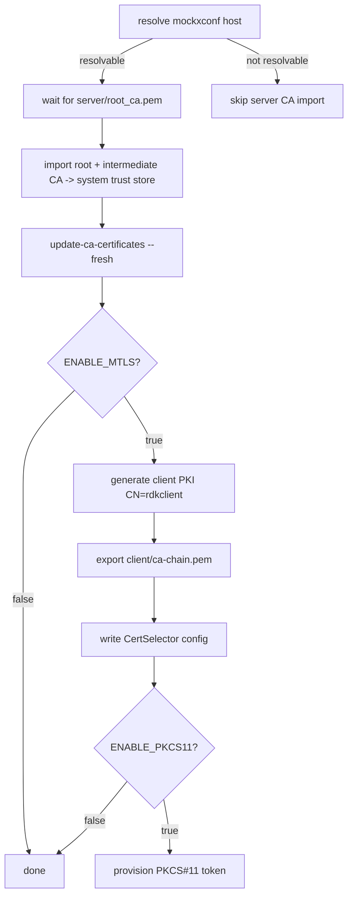

# `native-platform/certs.sh` — Consumer Walkthrough

## Overview

`native-platform/certs.sh` runs from the container's `entrypoint.sh`. It imports
the server CA chain published by `mock-xconf` into the system trust store, and —
when mTLS is enabled — generates the device's own client PKI, exports the client
CA chain back to `mock-xconf`, and (optionally) provisions a PKCS#11 token. The
script uses `set -e`, so any failed step aborts container startup.

## Flow



## 1. Import the server CA chain

The import only runs if the `mockxconf` host resolves (a DNS guard), so the
script is safe to run in single-container contexts:

```sh
MOCKXCONF_HOST=${MOCKXCONF_HOST:-mockxconf}
if getent ahosts "$MOCKXCONF_HOST" >/dev/null 2>&1; then
    while [ ! -f "$SHARED_CERTS_DIR/server/root_ca.pem" ]; do sleep 1; done
    cp "$SHARED_CERTS_DIR/server/root_ca.pem"         /usr/share/ca-certificates/mock-xconf-root-ca.pem
    cp "$SHARED_CERTS_DIR/server/intermediate_ca.pem" /usr/share/ca-certificates/mock-xconf-intermediate-ca.pem
    # register both in /etc/ca-certificates.conf, then:
    /usr/sbin/update-ca-certificates --fresh
    rm -f "$SHARED_CERTS_DIR/server/root_ca.pem" "$SHARED_CERTS_DIR/server/intermediate_ca.pem"
fi
```

After this, the device trusts the `mockxconf` server cert for ordinary (one-way)
TLS.

## 2. Generate client PKI (only when `ENABLE_MTLS=true`)

```sh
/etc/pki/scripts/generate_test_rdk_certs.sh --type client --cn "rdkclient"
```

Builds `Test-RDK-client-ICA` → `rdkclient`. The script validates and assembles
the client material:

| Variable | Path |
|----------|------|
| `CLIENT_CERT` | `/etc/pki/Test-RDK-root/Test-RDK-client-ICA/certs/rdkclient.pem` |
| `CLIENT_KEY` | `/etc/pki/Test-RDK-root/Test-RDK-client-ICA/private/rdkclient.key` |
| `CLIENT_P12` | `/etc/pki/Test-RDK-root/Test-RDK-client-ICA/certs/rdkclient.p12` |
| `CLIENT_ICA_CHAIN` | `/etc/pki/Test-RDK-root/Test-RDK-client-ICA/Test-RDK-client-ICA_chain.pem` |

```sh
cat "$CLIENT_CERT" >  /opt/certs/client.pem
cat "$CLIENT_KEY"  >> /opt/certs/client.pem
cp  "$CLIENT_P12"     /opt/certs/client.p12
cp  "$CLIENT_ICA_CHAIN" "$SHARED_CERTS_DIR/client/ca-chain.pem"   # for mock-xconf to trust
```

## 3. CertSelector configuration

The device's cert-selection library is configured via
`/etc/ssl/certsel/certsel.cfg`:

```
MTLS|SRVR_TLS,CLIENT_P12,P12,file:///opt/certs/client.p12,cfgOpsCert
MTLS_PEM,CLIENT_PEM,PEM,file:///opt/certs/client.pem,cfgOpsCert
```

When PKCS#11 is enabled, a `REFERENCE_P12` line is prepended so the
hardware-token-backed cert is tried first.

## 4. Optional PKCS#11 provisioning (`ENABLE_PKCS11=true`)

When enabled, the script:
1. Runs `setup-pkcs11-openssl.sh` to install the PKCS#11-patched OpenSSL
   (cached via the `/usr/local/openssl-pkcs11-ready` sentinel).
2. Creates a reference P12 with a sentinel key via `create_reference_p12`.
3. Runs `setup-pkcs11.sh` to initialize the token and import certs.

This path exercises hardware-backed key storage without a real HSM.

## Outputs Summary

| Artifact | Destination | Consumer |
|----------|-------------|----------|
| Server root CA | `/usr/share/ca-certificates/mock-xconf-root-ca.pem` | system trust store |
| Server intermediate CA | `/usr/share/ca-certificates/mock-xconf-intermediate-ca.pem` | system trust store |
| Client PEM (cert+key) | `/opt/certs/client.pem` | mTLS client |
| Client P12 | `/opt/certs/client.p12` | mTLS client |
| Client CA chain | `shared_certs/client/ca-chain.pem` | mock-xconf trust store |
| CertSelector config | `/etc/ssl/certsel/certsel.cfg` | cert-selection library |

## Failure Modes

| Symptom in logs | Cause |
|-----------------|-------|
| `mock-xconf not resolvable ... skipping server CA import` | Running without a linked `mockxconf`; expected in single-container use. |
| `Waiting for server root CA...` repeating forever | `mock-xconf` never wrote `server/root_ca.pem`. |
| `ERROR: Expected client certificate artifact missing or empty` | The client generator step failed; startup aborts. |
| `ERROR: PKCS#11 ... setup failed` | A PKCS#11 provisioning step returned non-zero. |

## See Also

- [PKI Hierarchy](../architecture/pki-hierarchy.md)
- [mock-xconf/certs.sh walkthrough](mock-xconf-certs.md)
- [Mutual TLS](mtls.md)
