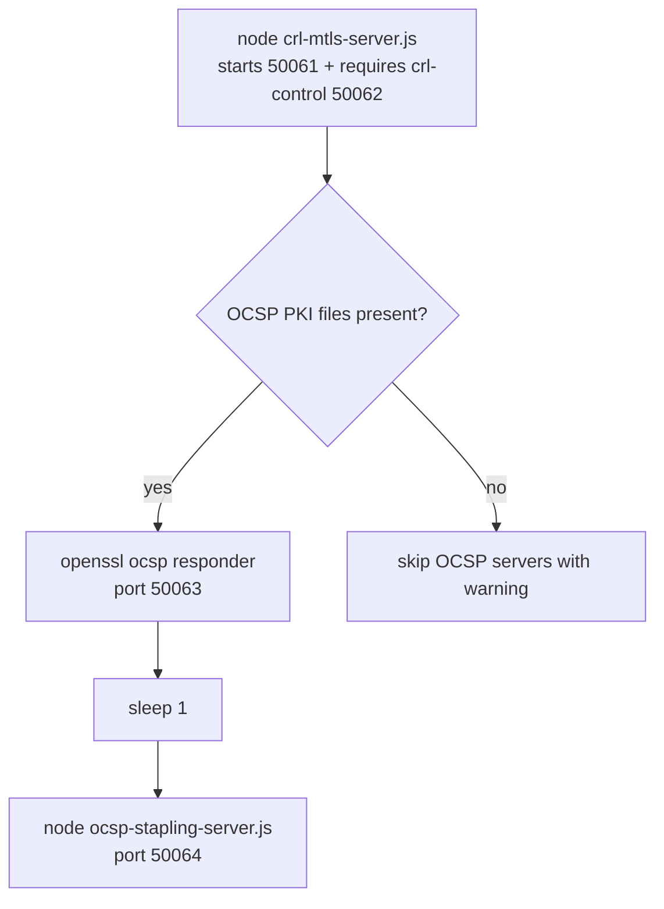

# L3 Integration and Wiring

> Applies when `ENABLE_CRL_L3=true`. For the baseline compose/ports/env model,
> see [../integration/compose-and-ports.md](../integration/compose-and-ports.md).

This page ties the L3 pieces together: the environment toggle, the ports, the
container startup order, the producer/consumer `certs.sh` blocks, and the test
assertions.

## Environment toggle

`ENABLE_CRL_L3=true` is set on both containers in `compose.yaml`. Every L3 code
path is gated on it, so with the flag unset the baseline behavior is unchanged.

| Variable | Effect |
|----------|--------|
| `ENABLE_CRL_L3` | Generates the CRL/OCSP/cross-signed PKI, starts the four L3 servers, and makes `native-platform` pick up and trust the L3 client assets |

## Ports

| Port | Service | Published to host? |
|------|---------|--------------------|
| 50061 | CRL mTLS server (`crl-mtls-server.js`) | Yes |
| 50062 | CRL control endpoint (`crl-control.js`) | Yes (local debugging) |
| 50063 | OCSP responder (`openssl ocsp`) | No — internal, IPv4-only, queried from `127.0.0.1` |
| 50064 | OCSP stapling server (`ocsp-stapling-server.js`) | No — reached container-to-container |

## Dependency bump

Both Dockerfiles pin `rdk-cert-config` to tag **1.0.6**, which provides the two
generator scripts the producer relies on:

- `mock-xconf/Dockerfile`: `git clone -b 1.0.6 ...`
- `native-platform/Dockerfile`: `git clone -b 1.0.6 ...` (was 1.0.4)

## Producer — `mock-xconf/certs.sh`

When `ENABLE_CRL_L3=true`, after the baseline mTLS block, the producer:

1. Creates `shared_certs/crl-client/` and `shared_certs/xs-client/`.
2. Runs `generate_crl_test_certs.sh` — server certs → `/etc/xconf/certs/crl` and
   `/etc/xconf/certs/ocsp`; client certs → `shared_certs/crl-client/`.
3. Runs `generate_cross_signed_test_certs.sh` with `XS_EXPIRY=1` — P12 bundles,
   XS CRLs, and the expired bridge → `shared_certs/xs-client/`.

## Consumer — `native-platform/certs.sh`

When `ENABLE_CRL_L3=true`, the consumer:

1. Waits for `crl-client/crl-client.p12`, then copies the CRL client assets to
   `/opt/certs/crl/` (`.key`/`.p12` → `600`, public PEMs → `644`).
2. Waits for `xs-client/NewRoot.pem` (the last-written sentinel), then copies
   the three XS P12 bundles and `NewRoot.pem` to `/opt/certs/xs/`.
3. Installs `Test-CRL-Root` and `Test-XS-NewRoot` into the system trust store
   and runs `update-ca-certificates --fresh`.

## Startup — `mock-xconf/entrypoint.sh`

When `ENABLE_CRL_L3=true`, after the baseline servers:

The responder starts before the stapling server so the latter can warm its OCSP
cache during `listen()`.

## Tests — `test_docker.py`

The container smoke tests are made L3-aware via a helper that reads the
container's env:

- `test_ports_are_open_ipv6_mockxconf` adds `50061, 50062, 50064` to the
  expected open ports when `ENABLE_CRL_L3=true`. (50063 is intentionally
  excluded — the `openssl` responder binds IPv4-only and never appears in
  `/proc/net/tcp6`.)
- `test_node_processes_running_mockxconf` expects the base **9** Node processes
  plus **2** more (`crl-mtls-server.js`, `ocsp-stapling-server.js`) when
  `ENABLE_CRL_L3=true`. `crl-control.js` runs inside the CRL mTLS process and is
  not counted separately.

## End-to-end L3 test suite

The behavioral L3 assertions live in `rdk-cert-config`'s
`test/functional-tests/tests/test_l3_crl_xsign.py` and drive the servers above
via `l3testapp`:

| Test | Scenario | Target | Expected |
|------|----------|--------|----------|
| `test_l3_crl_valid_then_revoked` | 1 | 50061 | `CURLE_OK` then `CURLE_RECV_ERROR` after `/crl/revoke` |
| `test_l3_xsign_bridge_succeeds` | 2 | 50061 | `CURLE_OK` |
| `test_l3_xsign_no_bridge_fails` | 3 | 50061 | `CURLE_RECV_ERROR` |
| `test_l3_xsign_expired_bridge_fails` | 4 | 50061 | `CURLE_RECV_ERROR`, under 5s |
| `test_l3_ocsp_staple_present` | 5 | 50064 | `CURLE_OK` |
| `test_l3_ocsp_staple_absent_rejected` | 6 | 50061 | `CURLE_SSL_INVALIDCERTSTATUS` |

## See Also

- [CRL mTLS Server](crl-mtls.md)
- [Cross-Signed PKI](cross-signed-pki.md)
- [OCSP Stapling](ocsp-stapling.md)
